<div align='center'>

# **Bash Scripting**

</div>

## **Table of Contents**

- [**1. Intro to Bash Scripting**](#1-intro-to-bash-scripting)
- [**2. Variables**](#2-variables)
  - [**2.1. Arguments**](#21-arguments)
  - [**2.2. Reading User Input**](#22-reading-user-input)
- [**3. If, Else, Elif Statements**](#3-if-else-elif-statements)
- [**4. Boolean Logical Operations**](#4-boolean-logical-operations)
- [**5. Loops**](#5-loops)
  - [**5.1. For Loops**](#51-for-loops)
  - [**5.2. While Loops**](#52-while-loops)
- [**6. Functions**](#6-functions)


## **1. Intro to Bash Scripting**

A Bash script is a plain-text file that contains a series of commands that are executed as if they had been typed at a terminal prompt.

**Creating a simple Hello World script**

```bash
#!/bin/bash
# Hello World Bash Script
echo "Hello World!"
```
- Line 1: #! is commonly known as the shebang, and is ignored by the Bash interpreter. The second part, `/bin/bash`, is the absolute path to the interpreter, which is used to run the script.
- Line 2: # is used to add a comment, so all text that follows it is ignored
- Line 3: echo "Hello World!" uses the echo Linux command utility to print a given string to the terminal

Use `chmod +x` to make the script executable and run it:

```bash
chmod +x hello_world.sh
./hello_world.sh
```

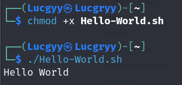

## **2. Variables**

**Declaring variables**

```bash
greeting='Hello World'
```

Get the value of a variable by prefixing it with a dollar sign:

```bash
echo $greeting
```

**Single quotes vs double quotes**

When encountering single quotes, Bash interprets every enclosed character literally. When enclosed in double quotes, all characters are viewed literally except "$", "`", and "\" meaning variables will be expanded in an initial substitution pass on the enclosed text

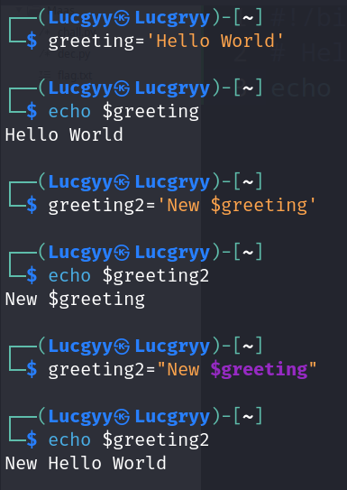

**Command substitution**

Take the output of a command or program and have it saved as the value of a variable

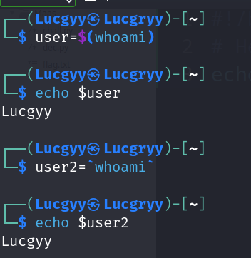

### **2.1. Arguments**

In this command: `ls -l /var/log`. Both `-l` and
`/var/log` are arguments to the `ls` command

Look at the script:

```bash
#!/bin/bash
echo "The first two arguments are $1 and $2"
```

The `$1` and `$2` variables represent the first and second arguments passed to the script

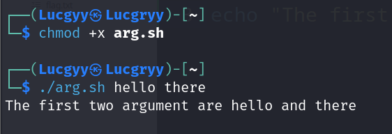

Here is few special variables:

<div align='center'>

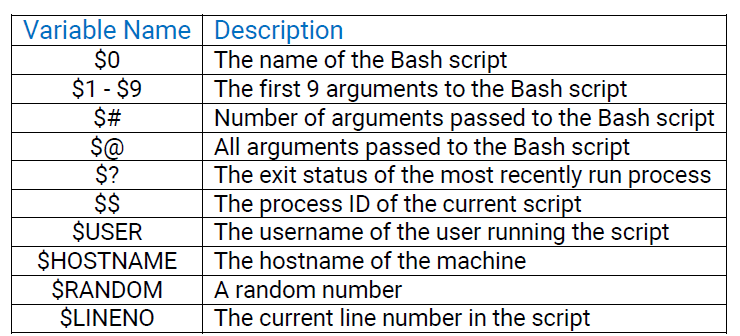

</div>

### **2.2. Reading User Input**

Use `read` command to capture user input

```bash
#!/bin/bash
echo "Hello there, would you like to learn how to hack: Y/N?"
read answer
echo "Your answer was $answer"
```

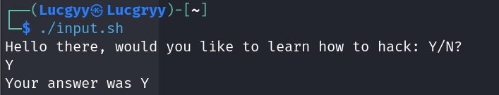

Two of the most commonly used options for the `read` command are `-p` and `-s`

- `-p` is used to specify a prompt
- `-s` is used to make the input silent

```bash
#!/bin/bash
# Prompt the user for credentials
read -p 'Username: ' username
read -sp 'Password: ' password
echo ""
echo "Thanks, your creds are as follows: " $username " and " $password
```

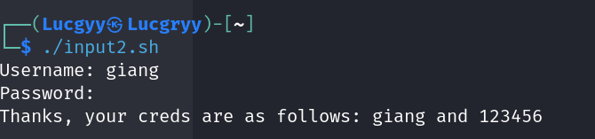

## **3. If, Else, Elif Statements**

```bash
if [ <some test> ]
then
<perform action>
elif [ <some test> ]
then
<perform different action>
else
<perform yet another different action>
fi
```

Here is the simple example:

```bash
#!/bin/bash
# elif example
read -p "What is your age: " age
if [ $age -lt 16 ]
then
    echo "You might need parental permission to take this course!"
elif [ $age -gt 60 ]
then
    echo "Hats off to you, respect!"
else
    echo "Welcome to the course!"
fi
```

In order of operation, the then branch executes if the entered age is less than sixteen, the elif branch is entered (and the "Hats off.." message displayed) if the age is greater than sixty, and the else branch executes only if the age is greater than sixteen but less than sixty

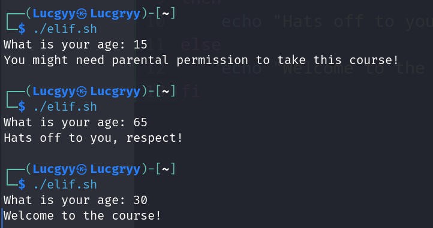

The spare brackets can be replaced with the `test` command:

```bash
#!/bin/bash
read -p "What is your age: " age
if test $age -lt 16
then
echo "You might need parental permission to take this course!"
fi
```

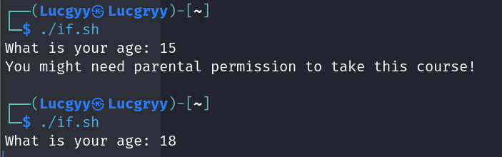

Here is some of the most common operators:

<div align='center'>

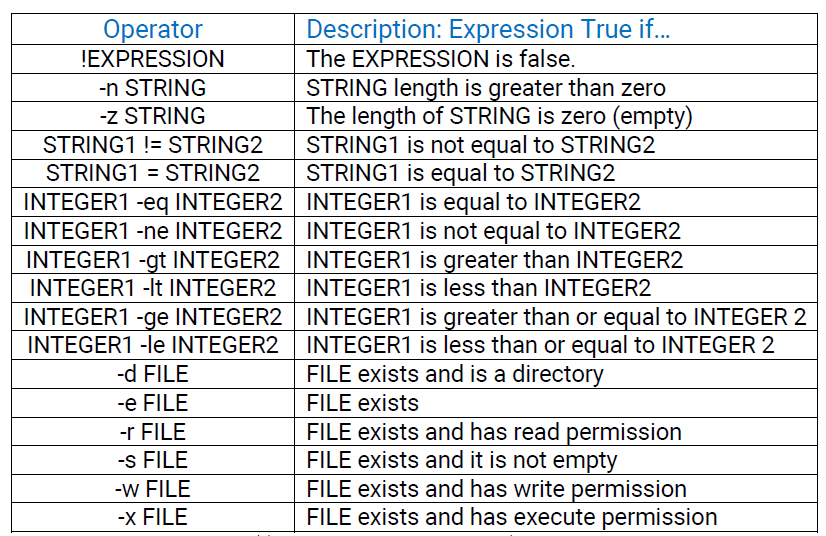

</div>

## **4. Boolean Logical Operations**

The "pipe" symbol `|` is used to pipe the output of one command to the input of another

```bash
cat /etc/password | grep root
```

The output of the `cat` command is piped to the `grep` command, which searches for the string "root" in the `/etc/passwd` file

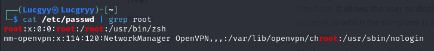

The `&&` and `||` operators are used to chain commands together based on the success or failure of a preceding command

- `&&` is used to execute a command only if the preceding command succeeds

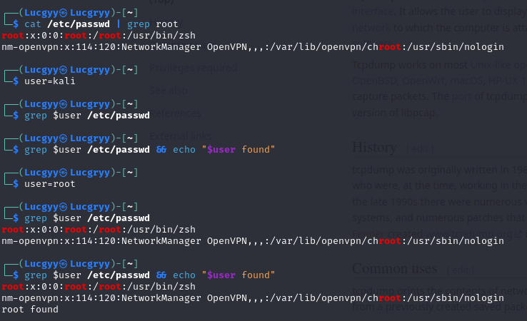

We use the grep command to check if a certain user is listed in the /etc/passwd file, and if it is, `grep` returns True and the `echo` command is executed. However, if the user is not listed, `grep` returns False and the `echo` command is not executed

- `||` is used to execute a command only if the preceding command fails

The `grep` command does not find a matching line
and returns False, the second echo command after the `||` operator is executed instead

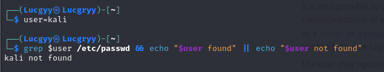

## **5. Loops**

### **5.1. For Loops**

```bash
for var-name in <list>
do
<action to perform>
done
```

The for loop will take each item in the list (in order), assign that item as the value of the variable var-name, perform the given action between do and done, and then go back to the top, grab the next item in the list, and repeat the steps until the list is exhausted.

Example:

```bash
for i in {1..10}; do echo 192.168.190.$i;done
```

We can see the brackets `{1..10}` are used to specify a range of numbers from 1 to 10. This is known as a "sequence expression"

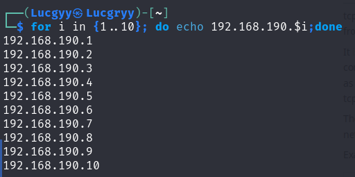

### **5.2. While Loops**

```bash
while [ <some test> ]
do
<perform an action>
done
```

The while loop will perform the given action between do and done as long as the given test is true

Example:

```bash
#!/bin/bash
# while loop example
counter=1
while [ $counter -le 10 ]
do
    echo "10.11.1.$counter"
    ((counter++))
done
```

The `((counter++))` line uses the double-parenthesis `(( ))` to increase our counter variable by one.

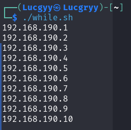

## **6. Functions**

Functions may be written in two different formats

```bash
function function_name {
commands...
}
```

or

```bash
function_name () {
commands...
}
```

Example:

```bash
#!/bin/bash
# function example
print_me () {
echo "You have been printed!"
}
print_me
```

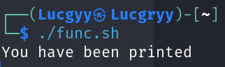

Functions can also accept arguments:

```bash
#!/bin/bash
# passing arguments to functions
pass_arg() {
    echo "Today's random number is: $1"
}
pass_arg $RANDOM
```

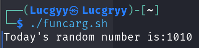

Bash functions do not actually allow you to return an arbitrary value in the traditional sense. Instead, a Bash function can return an exit status (zero for success, non-zero for failure) or some other arbitrary value that we can later access from the `$?` global variable

```bash
#!/bin/bash
# function return value example
return_me() {
    echo "Oh hello there, I'm returning a random value!"
    return $RANDOM
}
return_me
echo "The previous function returned a value of $?"
```

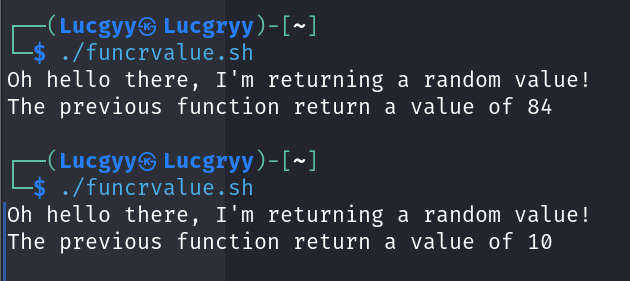

**Variable scope**

By default, a variable has a global scope, meaning it can be accessed throughout the entire script. In contrast, a local variable can only be seen within the function, block of code, or subshell in which it is defined.

We can "overlay" a global variable, giving it a local context, by preceding the declaration with the local keyword, leaving the global variable untouched

```bash
local name=value
```

Example:

```bash
#!/bin/bash
# var scope example
name1="John"
name2="Jason"
name_change() {
    local name1="Edward"
    echo "Inside of this function, name1 is $name1 and name2 is $name2"
    name2="Lucas"
}
echo "Before the function call, name1 is $name1 and name2 is $name2"
name_change
echo "After the function call, name1 is $name1 and name2 is $name2"
```

- Declared two global variables, setting `name1` to "John" and `name2` to "Jason"
- Defined a function and inside that function, declared a local variable called `name1`, setting the value to "Edward". Since this was a local variable, the previous global assignment was not affected; `name1` will still be set to "John" outside this function
- We set `name2` to "Lucas", and since we did not use the local keyword, we are changing the global variable, and the assignment sticks both inside and outside of the function

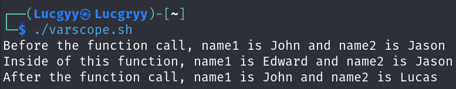