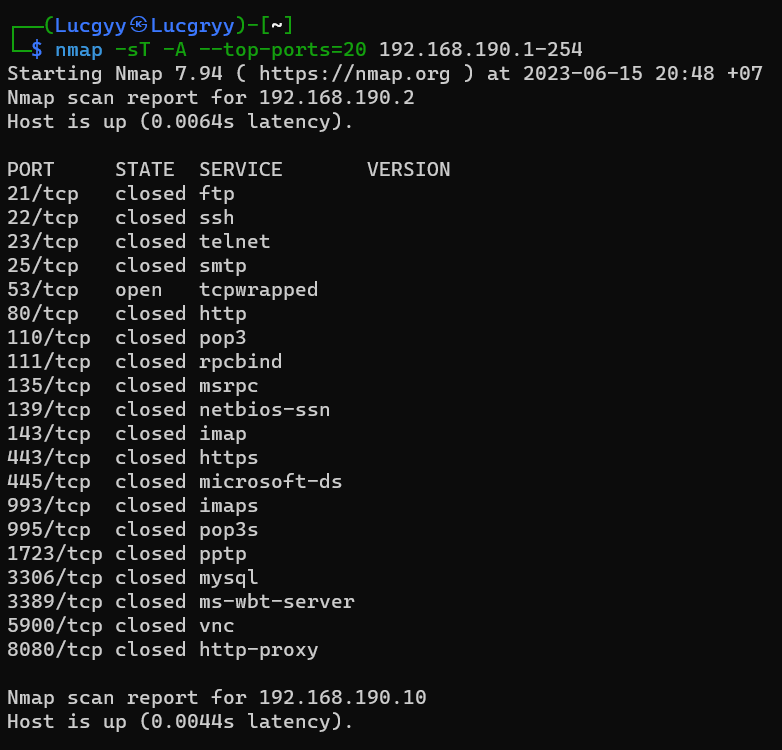
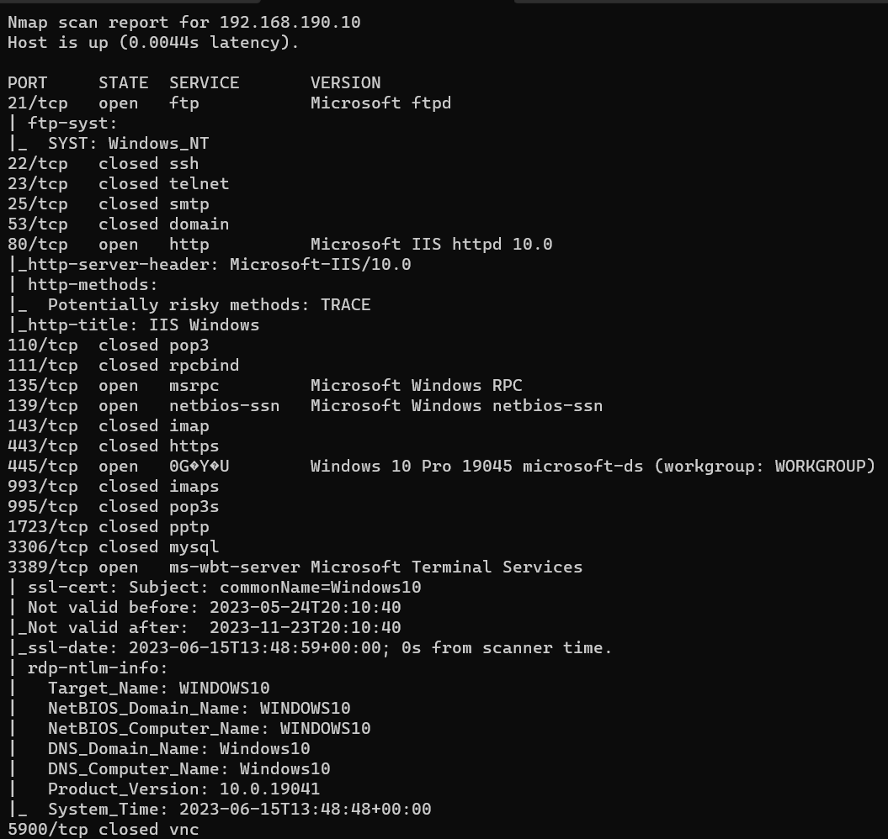
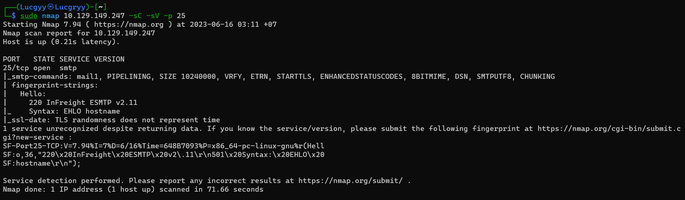
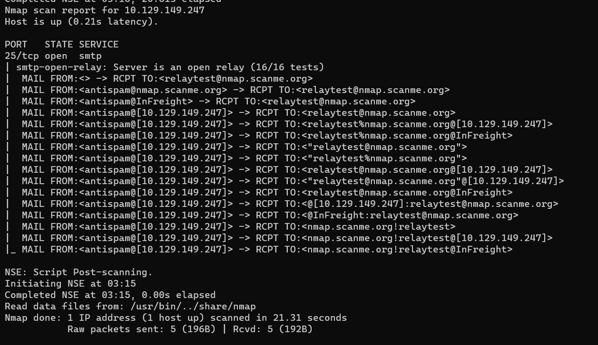

<div align='center'>

# **Active Information Gathering**

</div>

## **Table of Contents**
- [**1. DNS Enumeration**](#1-dns-enumeration)
    - [**1.1. Interacting with a DNS Server**](#11-interacting-with-a-dns-server)
    - [**1.2. Forward Lookup Brute Force**](#12-forward-lookup-brute-force)
    - [**1.3. Reverse Lookup Brute Force**](#13-reverse-lookup-brute-force)
    - [**1.4. DNS Zone Transfers**](#14-dns-zone-transfers)
    - [**1.5. DNSRecon**](#15-dnsrecon)
    - [**1.6. DNSenum**](#16-dnsenum)
- [**2. Port Scanning**](#2-port-scanning)
    - [**2.1. TCP/UDP Scanning**](#21-tcpudp-scanning)
        - [**2.1.1. TCP Scanning**](#211-tcp-scanning)
        - [**2.1.2. UDP Scanning**](#212-udp-scanning)
    - [**2.2. Port Scanning with Nmap**](#22-port-scanning-with-nmap)
        - [**2.2.1. Accountability for Our Traffic**](#221-accountability-for-our-traffic)
        - [**2.2.2. Stealth/SYN Scanning**](#222-stealthsyn-scanning)
        - [**2.2.3. TCP Connect Scanning**](#223-tcp-connect-scanning)
        - [**2.2.4. UDP Scanning**](#224-udp-scanning)
        - [**2.2.5. Network Sweeping**](#225-network-sweeping)
        - [**2.2.6. OS Fingerprinting**](#226-os-fingerprinting)
        - [**2.2.7. Banner Grabbing/Service Enumeration**](#227-banner-grabbingservice-enumeration)
        - [**2.2.8. Nmap Scripting Engine (NSE)**](#228-nmap-scripting-engine-nse)
    - [**2.3. Masscan**](#23-masscan)
- [**3. SMB Enumeration**](#3-smb-enumeration)
    - [**3.1. Scanning for the NetBIOS Service**](#31-scanning-for-the-netbios-service)
    - [**3.2. Nmap SMB NSE Scripts**](#32-nmap-smb-nse-scripts)
- [**4. NFS Enumeration**](#4-nfs-enumeration)
    - [**4.1. Scanning for NFS Shares**](#41-scanning-for-nfs-shares)
    - [**4.2. Nmap NFS NSE Scripts**](#42-nmap-nfs-nse-scripts)
- [**5. SMTP Enumeration**](#5-smtp-enumeration)
    - [**5.1. Scanning for the NetBIOS Service**](#51-scanning-for-the-netbios-service)
    - [**5.2. Nmap SMB NSE Scripts**](#52-nmap-smb-nse-scripts)
- [**6. SNMP Enumeration**](#6-snmp-enumeration)
    - [**6.1. Scanning for the NetBIOS Service**](#61-scanning-for-the-netbios-service)
    - [**6.2. Nmap SMB NSE Scripts**](#62-nmap-smb-nse-scripts)


Active information gathering is the process of interacting with the target system to gather information.

## **1. DNS Enumeration**

The Domain Name System (DNS) is one of the most critical systems on the Internet and is a distributed database responsible for translating user-friendly domain names into IP addresses

### **1.1. Interacting with a DNS Server**

Each domain can use different types of DNS records. Some of the most common types of DNS
records include:
- NS - Nameserver records contain the name of the authoritative servers hosting the DNS records for a domain.
- A - Also known as a host record, the "a record" contains the IP address of a hostname (such as www.megacorpone.com).
- MX - Mail Exchange records contain the names of the servers responsible for handling email for the domain. A domain can contain multiple MX records.
- PTR - Pointer Records are used in reverse lookup zones and are used to find the records associated with an IP address.
- CNAME - Canonical Name Records are used to create aliases for other host records.
- TXT - Text records can contain any arbitrary data and can be used for various purposes, such as domain ownership verification.

Use the `host` command to find the IP address of `cmctelecom.vn`:

```bash
host cmctelecom.vn
```


By default, the host command looks for an A record, but we can also query other fields. To do this, we can use the `-t` option to specify the type of record we are looking for

Find the MX records for `cmctelecom.vn`:

```bash
host -t mx cmctelecom.vn
```


Find the TXT records for `cmctelecom.vn`:

```bash
host -t txt cmctelecom.vn
```


Find the NS records for `cmctelecom.vn`:

```bash
host -t ns cmctelecom.vn
```


This domain does not have PTR and CNAME record


If the domain is not valid, the host command will return an error (NXDOMAIN)


### **1.2. Forward Lookup Brute Force**

We will use the wordlist `subdomains-top1mil-5000.txt` in the [SecLists](https://github.com/danielmiessler/SecLists) to brute force subdomains of `cmctelecom.vn`

```bash
for ip in $(cat /usr/share/seclists/Discovery/DNS/subdomains-top1million-5000.txt ); do host $ip.cmctelecom.vn; done | grep -v "NXDOMAIN"
```


We get some domain such as
- mail.cmctelecom.vn
- blog.cmctelecom.vn
- sms.cmctelecom.vn
- ...

### **1.3. Reverse Lookup Brute Force**

If the DNS administrator of `megacorpone.com` configured
PTR records for the domain, we could scan the approximate range with reverse lookups to request the hostname for each IP

Let’s use a loop to scan IP addresses 38.100.193.50 through 38.100.193.100. We will filter out invalid results by showing only entries that do not contain "not found" (with `grep -v`):

```bash
for ip in $(seq 50 100); do host 38.100.193.$ip; done | grep -v "not found"
```


We get some domain such as:
- syslog.megacorpone.com
- beta.megacorpone.com
- ns1.megacorpone.com
- ...

### **1.4. DNS Zone Transfers**

A zone transfer is basically a database replication between related DNS servers in which the zone file is copied from a master DNS server to a slave server. The zone file contains a list of all the DNS names configured for that zone. Zone transfers should only be allowed to authorized slave DNS servers but many administrators misconfigure their DNS servers, and in these cases, anyone asking for a copy of the DNS server zone will usually receive one

The host command syntax for performing a zone transfer is as follows:

```bash
host -l <domain name> <dns server address>
```

In [Chapter 6](./Chapter_6_Passive_Information_Gathering.md), we found that the DNS server for `megacorpone.com` is `ns1.megacorpone.com`, `ns2.megacorpone.com`, and `ns3.megacorpone.com`

Trying `ns1.megacorpone.com`, the transfer failed


Trying `ns2.megacorpone.com`, the transfer succeeded.


This server allows zone transfers and provides a full dump of the zone file for the `megacorpone.com` domain, delivering a convenient list of IP addresses and corresponding DNS hostnames!

### **1.5. DNSRecon**

[DNSRecon](https://github.com/darkoperator/dnsrecon) is an advanced, modern DNS enumeration script written in Python. Running `dnsrecon` against megacorpone.com using the `-d` option to specify a domain name, and `-t` to specify the type of enumeration to perform

**Perform a Zone Transfer**

```bash
dnsrecon -d megacorpone.com -t axfr

[*] Checking for Zone Transfer for megacorpone.com name servers
[*] Resolving SOA Record
[+]      SOA ns1.megacorpone.com 51.79.37.18
[*] Resolving NS Records
[*] NS Servers found:
[+]      NS ns1.megacorpone.com 51.79.37.18
[+]      NS ns3.megacorpone.com 66.70.207.180
[+]      NS ns2.megacorpone.com 51.222.39.63
[*] Removing any duplicate NS server IP Addresses...
[*]
[*] Trying NS server 66.70.207.180
[+] 66.70.207.180 Has port 53 TCP Open
[-] Zone Transfer Failed (Zone transfer error: REFUSED)
[*]
[*] Trying NS server 51.222.39.63
[+] 51.222.39.63 Has port 53 TCP Open
[+] Zone Transfer was successful!!
[*]      NS ns1.megacorpone.com 51.79.37.18
[*]      NS ns2.megacorpone.com 51.222.39.63
[*]      NS ns3.megacorpone.com 66.70.207.180
[*]      TXT Try Harder
[*]      TXT google-site-verification=U7B_b0HNeBtY4qYGQZNsEYXfCJ32hMNV3GtC0wWq5pA
[*]      MX @.megacorpone.com fb.mail.gandi.net 217.70.178.216
[*]      MX @.megacorpone.com fb.mail.gandi.net 217.70.178.217
[*]      MX @.megacorpone.com fb.mail.gandi.net 217.70.178.215
[*]      MX @.megacorpone.com spool.mail.gandi.net 217.70.178.1
[*]      A admin.megacorpone.com 51.222.169.208
[*]      A beta.megacorpone.com 51.222.169.209
[*]      A fs1.megacorpone.com 51.222.169.210
[*]      A intranet.megacorpone.com 51.222.169.211
[*]      A mail.megacorpone.com 51.222.169.212
[*]      A mail2.megacorpone.com 51.222.169.213
[*]      A ns1.megacorpone.com 51.79.37.18
[*]      A ns2.megacorpone.com 51.222.39.63
[*]      A ns3.megacorpone.com 66.70.207.180
[*]      A router.megacorpone.com 51.222.169.214
[*]      A siem.megacorpone.com 51.222.169.215
[*]      A snmp.megacorpone.com 51.222.169.216
[*]      A support.megacorpone.com 51.222.169.218
[*]      A syslog.megacorpone.com 51.222.169.217
[*]      A test.megacorpone.com 51.222.169.219
[*]      A vpn.megacorpone.com 51.222.169.220
[*]      A www.megacorpone.com 149.56.244.87
[*]      A www2.megacorpone.com 149.56.244.87
[*]
[*] Trying NS server 51.79.37.18
[+] 51.79.37.18 Has port 53 TCP Open
[-] Zone Transfer Failed (Zone transfer error: REFUSED)
```

**Brute force subdomains**

Use `-D` option to specify a wordlist. `brt` stands for brute force.

```bash
dnsrecon -d megacorpone.com -D /usr/share/seclists/Discovery/DNS/subdomains-top1million-5000.txt -t brt
```


### **1.6. DNSenum**

[DNSenum](https://github.com/fwaeytens/dnsenum) is a Perl script that performs a variety of DNS enumeration tasks. It is a very useful tool for performing DNS enumeration in a single command.

```bash
dnsenum megacorpone.com
```


## **2. Port Scanning**

Port scanning is the process of inspecting TCP or UDP ports on a remote machine with the intention of detecting what services are running on the target and what potential attack vectors may exist.

### **2.1. TCP/UDP Scanning**

#### **2.1.1. TCP Scanning**

The simplest TCP port scanning technique, usually called CONNECT scanning, relies on the threeway TCP handshake mechanism

A host sends a TCP SYN packet to a server on a destination port. If the destination port is open, the server responds with a SYN-ACK packet and the client host sends an ACK packet to complete the handshake. If the handshake completes successfully, the port is considered open

We will run a TCP Netcat port scan on ports 3388-3390. The `-w` option specifies the connection timeout in seconds and `-z` is used to specify zero-I/O mode, which will send no data and is used for scanning

```bash
nc -nvv -w 1 -z 192.168.190.2 3388-3390
```


Based on this output, we can see that port 3389 is open while connections on ports 3388 and 3390 timed out.

Here is the network traffic


Netcat sent several TCP SYN packets to ports 3390, 3389, and 3388. The server sent a TCP SYN-ACK packet from port 3389 on line 6, indicating that the port is open. The other ports did not reply with a similar SYN-ACK packet, so we can infer that they are not open

#### **2.1.2. UDP Scanning**

We will run a UDP Netcat port scan on ports 160-162. The `-u` option specifies UDP mode

```bash
nc -nv -u -z -w 1 192.168.190.16 160-162
```


Based on this output, we can see that only port 161 is opened.

Here is the network traffic


An empty UDP packet is sent to a specific port. If the destination UDP port is open, the packet will be passed to the application layer and the response received will depend on how the application is programmed to respond to empty packets. If the destination UDP port is closed, the target should respond with an ICMP port unreachable. That is sent by the UDP/IP stack of the target machine

### **2.2. Port Scanning with Nmap**

[Nmap](https://nmap.org) is a powerful network scanning tool that can be used to perform a wide variety of network scans.

#### **2.2.1. Accountability for Our Traffic**

A default Nmap TCP scan will scan the 1000 most popular ports on a given machine

We'll scan the Windows Server 2016 (192.168.190.16) while monitoring the amount of traffic sent to the target host using `iptables`

```bash
sudo iptables -I INPUT 1 -s 10.11.1.220 -j ACCEPT
sudo iptables -I OUTPUT 1 -d 10.11.1.220 -j ACCEPT
sudo iptables -Z
```

- `-I` option is used to insert a rule at the beginning of the chain
    - `INPUT`: Inbound
    - `OUTPUT`: Outbound
- `-s` option is used to specify the source IP address
- `-d` option is used to specify the destination IP address
- `-j` option is used to specify the action to take
    - `ACCEPT`: Allow the traffic
- `-Z` option is used to zero the packet and byte counters

Use nmap to scan the target host

```bash
nmap 192.168.190.16
```


Examine the traffic statistics

```bash
sudo iptables -L -vn
```


This type of scan has generated about 66 KB of traffic

Let's use `iptables -Z` to zero the packet and byte counters in all chains again and run another `nmap` scan using `-p` to specify ALL TCP ports

```bash
nmap -p- 192.168.190.16
```


Examine the traffic statistics


This type of scan has generated about 4MB of traffic

#### **2.2.2. Stealth/SYN Scanning**

SYN scanning is a TCP port scanning method that involves sending SYN packets to various ports on a target machine without completing a TCP handshake. If a TCP port is open, a SYN-ACK should be sent back from the target machine, informing us that the port is open.

The `-sS` option is used to specify a SYN scan

```bash
sudo nmap -sS 192.168.190.16
```


Network traffic on open port


Network traffic on closed port


Because the three-way handshake is never completed, the information is not passed to the application layer and as a result, will not appear in any application logs. A SYN scan is also faster and more efficient because fewer packets are sent and received

#### **2.2.3. TCP Connect Scanning**

When a user running nmap does not have raw socket privileges, Nmap will default to the TCP connect scan

The `-sT` option is used to specify a TCP connect scan

```bash
nmap -sT 192.168.190.16
```


Network traffic on open port


Network traffic on closed port


#### **2.2.4. UDP Scanning**

Nmap will use the standard "ICMP port unreachable" method described earlier by sending an empty packet to a given port. However, for common ports, such as port 161, which is used by SNMP, it will send a protocol-specific SNMP packet in an attempt to get a response from an application bound to that port

The `-sU` option is used to specify a UDP scan (sudo must be used)

```bash
sudo nmap -sU 192.168.190.16
```


Network traffic on open port


Network traffic on closed port


#### **2.2.5. Network Sweeping**

When performing a network sweep with Nmap using the -sn option, the host discovery process consists of more than just sending an ICMP echo request. Several other probes are used in addition to the ICMP request. Nmap also sends a TCP SYN packet to port 443, a TCP ACK packet to port 80, and an ICMP timestamp request to verify if a host is available or not

```bash
nmap -sn 192.168.190.1-254
```


Sweep for specific TCP or UDP ports across the network, probing for common services and ports, in an attempt to locate systems that may be useful, or otherwise have known vulnerabilities


```bash
nmap -p 80 192.168.190.1-254
```


TCP connect scan for the top twenty TCP ports with the `--top-ports` option and enable OS version detection, script scanning, and traceroute with `-A:`

```bash
nmap -sT -A --top-ports=20 192.168.190.1-254
```






The top twenty nmap ports are determined using the `/usr/share/nmap/nmap-services` file. The file uses a simple format of three whitespace-separated columns. The first is the name of the service, the second contains the port number and protocol, and the third, the "port frequency"


#### **2.2.6. OS Fingerprinting**

This feature attempts to guess the target’s operating system by inspecting returned packets. This is possible because operating systems often have slightly different implementations of the TCP/IP stack (such as varying default TTL values and TCP window sizes) and these slight variances create a fingerprint that Nmap can often identify

```bash
sudo nmap -O 192.168.190.16
```


We can see that the target may be running Windows Server 2016

#### **2.2.7. Banner Grabbing/Service Enumeration**

We can also identify services running on specific ports by inspecting service banners (`-sV`) and running various OS and service enumeration scripts (`–A`) against the target

```bash
nmap -sV -sT -A 192.168.190.16
```


#### **2.2.8. Nmap Scripting Engine (NSE)**

We can use the Nmap Scripting Engine (NSE) to launch user-created scripts in order to automate various scanning tasks. NSE scripts are located in the `/usr/share/nmap/scripts` directory

The `smb-os-discovery` script attempts to connect to the SMB service on a target system and determine its operating system:

```bash
nmap 192.168.190.16 --script=smb-os-discovery
```


`dns-zone-transfer` NSE script. `-Pn` option is used to skip the host discovery phase

```bash
nmap --script=dns-zone-transfer -p -Pn 53 ns2.megacorpone.com
```


### **2.3. Masscan**

Masscan is arguably the fastest port scanner; it can scan the entire Internet in about 6 minutes, transmitting an astounding 10 million packets per second

```bash
sudo masscan -p80 192.168.190.0/24
```


## **3. SMB Enumeration**

### **3.1. Scanning for the NetBIOS Service**

The NetBIOS service listens on TCP port 139 as well as several UDP ports.

NetBIOS is an independent session layer protocol and service that allows computers on a local network to communicate with each other

While modern implementations of SMB can work without NetBIOS, NetBIOS over TCP (NBT) is required for backward compatibility and is often enabled together

Using `nmap`:

```bash
nmap -p 139,445 192.168.190.1-254
```


Using [nbtscan](https://github.com/charlesroelli/nbtscan):

```bash
nbtscan -r 192.168.190.0/24
```

- `-r`: specify the originating UDP port as 137


### **3.2. Nmap SMB NSE Scripts**

All SMB related NSE scripts are located in the `/usr/share/nmap/scripts/` directory


We have used the `smb-os-discovery` script in the previous section. Now we will use the `smb-vuln-cve-2017-7494` script to check if the target is vulnerable to the SambaCry vulnerability

```bash
nmap --script=smb-vuln-cve-2017-7494 --script-args=smb-vuln-cve-2017-7494.check-version -p 445 192.168.190.16
```


The result shows that the target is not vulnerable to SambaCry

## **4. NFS Enumeration**

Network File System (NFS) is a distributed file system protocol originally developed by Sun Microsystems in 1984. It allows a user on a client computer to access files over a computer network as if they were on locally-mounted storage

### **4.1. Scanning for NFS Shares**

Both Portmapper and RPCbind run on TCP port 111. RPCbind maps RPC services to the ports on which they listen. RPC processes notify rpcbind when they start, registering the ports they are listening on and the RPC program numbers they expect to serve.

The client system then contacts rpcbind on the server with a particular RPC program number. The rpcbind service redirects the client to the proper port number (often TCP port 2049) so it can communicate with the requested service.

Using `nmap` to enumarate the host running rpcbind:

```bash
nmap -p 111 192.168.190.1-254
```


We can see that the host with IP address 192.168.190.16 is running rpcbind

Use NSE scripts `rpcinfo` to find services that may have registered with rpcbind

```bash
nmap -sV -p 111 --script=rpcinfo 192.168.190.16
```


We can see that this host is running NFS

### **4.2. Nmap NFS NSE Scripts**

NFS NSE related scripts:


Run all NFS NSE scripts against the target

```bash
nmap -p 111 --script nfs* 192.168.190.16
```


We can see that the `/Data` directory is shared

We can access the shared data


## **5. SMTP Enumeration**

Simple Mail Transfer Protocol (SMTP) is a protocol for sending email messages between servers. SMTP is a text-based protocol in which the sender communicates with the mail receiver by issuing commands and receiving a response code

Use netcat to connect to the SMTP server

```bash
ncat -nv <IP-address> 25
```


A `VRFY` request asks the server to verify an email address


Notice how the success and error messages differ. This can be used to enumerate valid email addresses. 

Here is the python script to enumerate valid email addresses for a given list of usernames

```python
import socket
import sys
if len(sys.argv) != 2:
    print("Usage: vrfy.py <username>")
    sys.exit(0)
# Create a Socket
s = socket.socket(socket.AF_INET, socket.SOCK_STREAM)
# Connect to the Server
connect = s.connect(('10.129.149.247',25))
# Receive the banner
banner = s.recv(1024)
print(banner)
with open(sys.argv[1], 'r') as f:
    for line in f:
        line = line.strip()
        # VRFY a user
        s.send(('VRFY ' + line + '\r\n').encode())
        result = s.recv(1024).decode()
        if not result.startswith('550'):
            print(result, end='')
# Close the socket
s.close()
```


**Nmap**

Use `-sC` to enable the default scripts and `-sV` to enable version detection. The default scripts include smtp-commands, which uses the EHLO command to list all possible commands that can be executed on the target SMTP server

```bash
sudo nmap 10.129.149.247 -sC -sV -p 25
```



Use the `smtp-open-relay` NSE script to identify the target SMTP server as an open relay using 16 different tests

```bash
sudo nmap 10.129.149.247 -p25 --script=smtp-open-relay -v
```



## **6. SNMP Enumeration**

Simple Network Management Protocol (SNMP) is a protocol for collecting and organizing information about managed devices on IP networks and for modifying that information to change device behavior

### **6.1. The SNMP MIB Tree**

The SNMP Management Information Base (MIB) is a database containing information usually related to network management. The database is organized like a tree, where branches represent different organizations or network functions. The leaves of the tree (final endpoints) correspond to specific variable values that can then be accessed, and probed, by an external user


Some SNMP MIB values

| MIB Value | Description |
| --- | --- |
| 1.3.6.1.2.1.25.1.6.0 | System Processes |
| 1.3.6.1.2.1.25.4.2.1.2 | Running Programs |
| 1.3.6.1.2.1.25.4.2.1.4 | Processes Path |
| 1.3.6.1.2.1.25.2.3.1.4 | Storage Units |
| 1.3.6.1.2.1.25.6.3.1.2 | Software Name |
| 1.3.6.1.4.1.77.1.2.25 | User Accounts |
| 1.3.6.1.2.1.6.13.1.3 | TCP Local Ports |

### **6.2. Scanning for SNMP Services**

Use `nmap` to scan for SNMP services. The -sU
option is used to perform UDP scanning and the --open option is used to limit the output to only display open ports

```bash
sudo nmap -sU --open -p 161 192.168.190.1-254
```


The result shows that the host with IP address 192.168.190.16, and 192.168.190.19 are running SNMP

Community strings can be seen as passwords that are used to determine whether the requested information can be viewed or not

We can use [onesixtyone](https://github.com/trailofbits/onesixtyone) to enumerate SNMP community strings

```bash
onesixtyone -c /usr/share/seclists/Discovery/SNMP/snmp.txt 192.168.190.16
```


We get the community string `public`

### **6.3. Windows SNMP Enumeration Example**

`smnpwalk` is a command-line tool that can be used to enumerate SNMP information from a target host

#### **6.3.1. Enumerating the Entire MIB Tree**

```bash
snmpwalk -c public -v1 -t 10 192.168.190.16
```

- `-c`: specify the community string
- `-v`: specify the SNMP version
- `-t`: specify the timeout to 10 seconds


#### **6.3.2. Enumerating Windows Users**

```bash
snmpwalk -c public -v1 192.168.190.16 1.3.6.1.4.1.77.1.2.25
```


We get a list of Windows users

#### **6.3.3. Enumerating Running Windows Processes**

```bash
snmpwalk -c public -v1 192.168.190.16 1.3.6.1.2.1.25.4.2.1.2
```


#### **6.3.4. Enumerating Open TCP Ports**

```bash
snmpwalk -c public -v1 192.168.190.16 1.3.6.1.2.1.6.13.1.3
```


#### **6.3.5. Enumerating Installed Software**

```bash
snmpwalk -c public -v1 192.168.190.16 1.3.6.1.2.1.25.6.3.1.2
```

